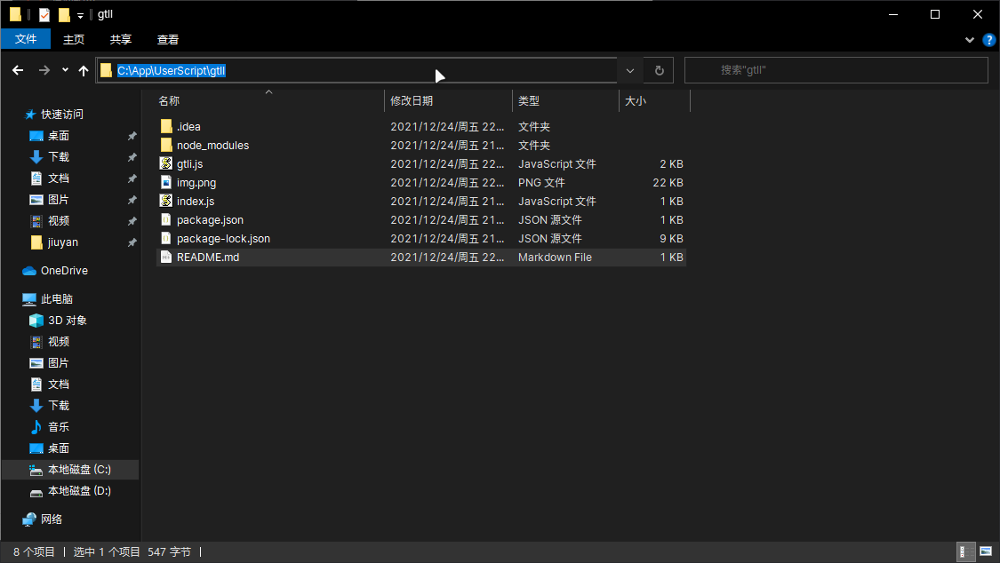

# 哥特自动签到
推荐使用Chrome设为默认浏览器，或者新版Microsoft Edge浏览器

## 网页自动签到
通过油猴脚本模拟网页点击实现自动签到

浏览器下载 [油猴脚本](https://chrome.google.com/webstore/detail/tampermonkey/dhdgffkkebhmkfjojejmpbldmpobfkfo) 插件，安装 [自动签到脚本](https://greasyfork.org/zh-CN/scripts/437544-%E5%93%A5%E7%89%B9%E5%8A%A8%E6%BC%AB%E7%8E%8B%E5%9B%BD%E8%87%AA%E5%8A%A8%E7%AD%BE%E5%88%B0) ，刷新首页即可自动签到

## 自动打开网页
通过Node实现自动打开网页，每天打开的时间通过index.js文件控制

下载安装 [Node Js](https://nodejs.org/zh-cn/) ，安装完成按住`Win`+`R`键输入cmd，打开命令行窗口，输入npm -v 查看是否安装成功
```shell
npm -v
```
在当前文件夹内，在鼠标位置输入`cmd`后回车，会打开当前路径的命令行窗口，运行下面的代码进行编译

```shell
npm i
```
编译完成后，会生成`node_modules`目录，然后输入下列代码，并保持命令行窗口运行，即可自动打开网页配合油猴脚本签到
```shell
node index
```
## 待优化部分
- [ ] 全自动签到
- [ ] 页面启动时间
> 目前最准确的签到是在23:59:59前刷新首页，确保网页有最新的缓存，网络没问题即可于12点整时打开签到页面（可能会存在时间差，我也不能保证），浏览器运行的情况下不这样操作会延迟1秒左右，如果关闭浏览器后，签到会慢3~4秒，建议保持浏览器运行配合脚本签到，或者手动刷新网页
